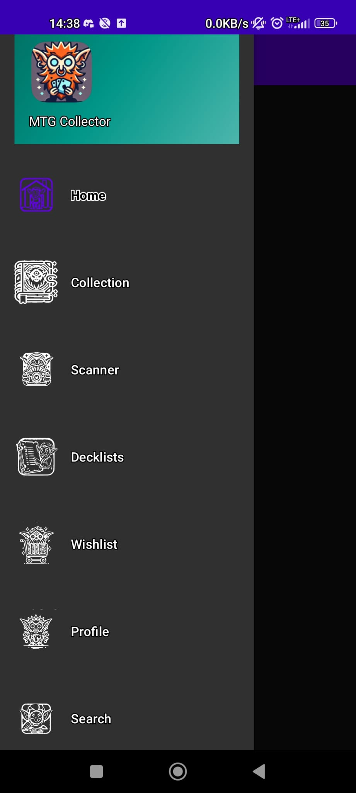
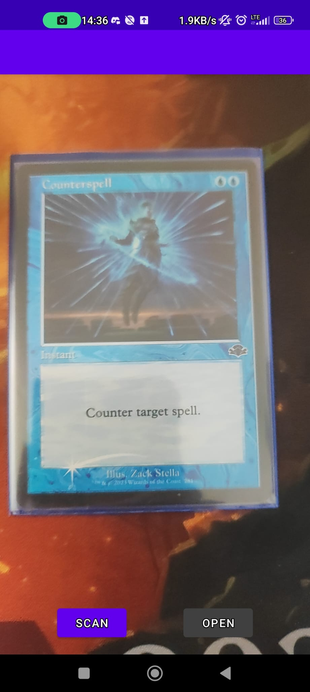
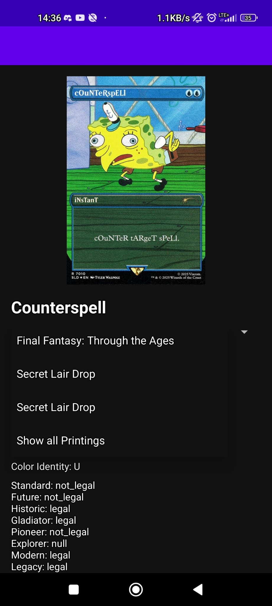
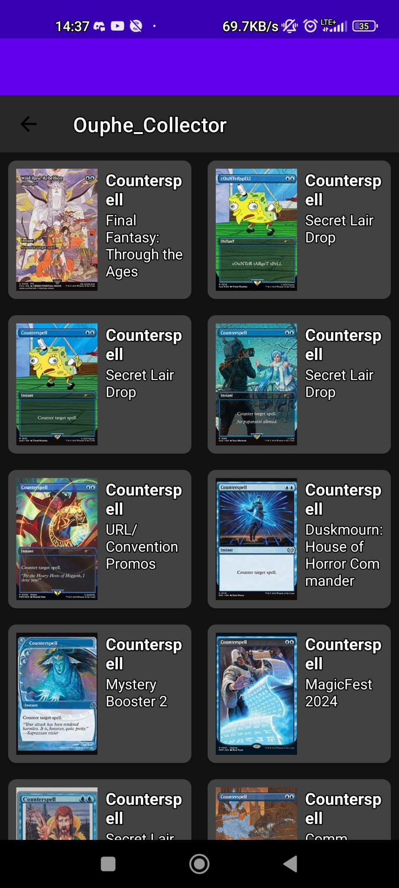

## OupheCollector 
<p float="left"> 
   
</p> 

**OupheCollector** is an Android app designed for Magic: The Gathering (MTG) players to manage their card collections, build decks, and create wishlists. With integrated **card scanning** and **Scryfall API** support, the app helps players digitize, organize, and explore their MTG libraries from their mobile device.

> ⚠️ This app is currently under development. Some features are experimental or not yet complete.

---

## ✨ Features

- 📸 **Card Scanning** – Scan physical cards using your device camera to identify them via OCR
- 🔍 **Search Cards** – Find any MTG card using Scryfall’s fast and comprehensive API
- 📚 **Collection Management** – Track which cards you own, including quantity and special versions (e.g. foils)
- 🧩 **Deck Builder** – Create and edit decks from your collection
- 🎯 **Wishlists** – Save cards you'd like to acquire later
- 👤 **User Profiles** – Create a local profile to manage your collections and decks
- 🌐 **Live Card Data** – Pull card info, rulings, and images in real-time from [Scryfall](https://scryfall.com)

---

## 🛠 Tech Stack

- **Language**: Java
- **UI**: Android Views / XML Layouts
- **Architecture**: MVVM (Model-View-ViewModel)
- **Networking**: Retrofit
- **Image Loading**: Picasso
- **Database**: Room (Jetpack persistence library)
- **Scanning/OCR**: ML Kit (Google’s Mobile Vision library)
- **API**: [Scryfall API](https://scryfall.com/docs/api)

---

## 📦 Installation

1. Clone the repo:
   ```bash
   git clone https://github.com/DiegoJimenezTamame/OupheCollector.git
   cd OupheCollector
   ```

2. Open the project in **Android Studio** (Chipmunk or newer)

3. Allow Gradle to sync and download all dependencies.

4. Run the app on an emulator or connected device:
   ```bash
   ./gradlew installDebug
   ```

---

## 🧪 Development Status

| Feature               | Status        |
|-----------------------|---------------|
| Manual Card Search    | ✅ Implemented |
| Card Scanner (OCR)    | ⚙️ In Progress |
| Collection Tracker    | ✅ Basic version functional |
| Deck Builder          | ⚙️ MVP Prototype |
| Wishlists             | ✅ Functional |
| User Profiles         | ⚠️ Local-only (no auth yet) |
| Data Persistence      | ✅ Room database |
| Scryfall Integration  | ✅ Live card fetch |

---

## 🖼 Screenshots

📸 Screenshots
<p float="left"> 
   
  
   
   
</p>

---

## 🧩 How It Works

- **Scanning Cards**: Uses OCR to read card names and query Scryfall for info.
- **Searching**: Uses Retrofit to fetch card data based on user input.
- **Collections & Decks**: Stored locally with Room database.
- **Wishlists**: Mark cards for future tracking with notes or desired quantities.

---

## 🧑‍💻 Contributing

Contributions are welcome!

1. Fork the repo  
2. Create your feature branch:
   ```bash
   git checkout -b feature/amazing-feature
   ```
3. Commit your changes:
   ```bash
   git commit -m "Add amazing feature"
   ```
4. Push to the branch and open a Pull Request

Please create an issue for any major changes to discuss the plan.

---

## 🔭 Roadmap

- [ ] Improve OCR accuracy for scanning cards
- [ ] Add user authentication (Firebase or local multi-profile support)
- [ ] Enable deck export/import (.txt, .csv)
- [ ] Add price tracking from Scryfall, CardMarket and TCGPlayer
- [ ] Add dark mode and theming options

---

## 🛡 License

This project is licensed under the **MIT License** – see the [LICENSE](LICENSE) file for details.

---

## 👤 Author

**Diego Jimenez Tamame**  

📂 [GitHub](https://github.com/DiegoJimenezTamame)

---

## 🙏 Acknowledgements

- [Scryfall API](https://scryfall.com) – MTG card database and RESTful API  
- [Android Developers](https://developer.android.com/) – Documentation and Jetpack libraries  
- [Google ML Kit](https://developers.google.com/ml-kit) – For OCR scanning  
- MTG Community – For constant inspiration and playtesting feedback!

---
